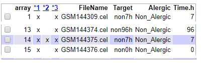

```{r setup, include=FALSE}
knitr::opts_chunk$set(echo = TRUE)
#Si se requiere instalar los paquetes básicos para reproducir el estudio 
#poner la variable firsstime=T

options(repos="https://cran.rstudio.com")
firsttime <- F
if(firsttime){
install.packages("knitr")
install.packages("colorspace")
install.packages("gplots")
install.packages("ggplot2")
install.packages("ggrepel")
install.packages("htmlTable")
install.packages("prettydoc")
install.packages("devtools")
install.packages("BiocManager")
BiocManager::install(c("limma","genefilter","pvca","annotate","arrayQualityMetrics","oligo","HG-U133_Plus_2.db","org.Hs.eg.db","ReactomePA","reactome.db"), update = FALSE, ask = FALSE)

}


setwd("~/UOC_ANNA/ADO_PEC1/ADO_PEC1")
workingDir <-getwd()
dataDir <-file.path(workingDir, "data")
resultsDir <- file.path(workingDir, "results")
```
# Tabla de contenidos
1. Abstract
2. Objetivos
3. Materiales y métodos
4. Resultados
5. Discusión
6. Bibliografía
7. Anexos


## Enlace Github:

https://github.com/acasquetp/ADO_PEC1


# Abstract

Este estudio (GSE6281) pretende investigar la expresión génica en la piel humana de la respuesta inflamatoria que resulta en dermatítis de contacto alérgica (ACD). 
Se obtuvieron biopsias de piel normal y expuesta a níquel de 7 pacientes alérgicos al níquel y 5 controles no alérgicos en cuatro puntos de tiempo diferentes generando una serie temporal.
Para el estudio se usaron microarrays Matriz Affymetrix Human Genome U133 Plus 2.0.

# Objetivos

El objetivo del presente estudio es valorar la expresión génica en el tiempo sobre una muestra alérgica al níquel en contraposición a controles no alérgicos.

# Materiales y métodos


Se reclutaron siete pacientes alérgicos al níquel y cinco controles no alérgico. Todos los participantes eran mujeres. La edad de los pacientes varió de 33 a 49 (edad media 40) y la edad de los controles varió de 31 a 55 (edad media 43). Ninguno de los participantes usó medicamentos inmunosupresores durante el tiempo del estudio. 

Se obtuvieron biopsias de piel de piel normal y expuesta a níquel de 7 pacientes alérgicos al níquel y 5 controles no alérgicos en cuatro puntos de tiempo diferentes durante la activación del eccema: 0h, 7h, 48h y 96h.

Cada perfil de expresión génica se analizó por hibridación con matrices de oligonucleótidos de alta densidad GeneChip Human Genome U133 con cobertura completa del conjunto Human Genome U133, más 6,500 genes adicionales para el análisis de más de 47,000 transcripciones.

Este estudio de comparación de grupos donde se pretende determinar los perfiles de expresión génica entre grupos previamente seleccionados.

### Análisis de datos

La computación de los datos se ha realizado mediante el entorno R (versión 4.0.0) usando el Ide RStudio.
Los datos para el análisi han sido obtenidos directamente de los archivos .CEL escaneados de los microarrays.

Se ha identificado los grupos a los que pertenece cada muestra y se ha generado el archivo targLimma.csv con la matriz de objetivos para poder generar a posteriori las diferentes matrices de datos, así como definir los archivos de origen.


```{r datos ,echo=FALSE,  include=FALSE}

library(oligo)
library(Biobase)

# LEctura archivo objetivos
targets <- read.csv2("./data/targLimma.txt", header = TRUE, sep = "\t")
knitr::kable( targets, booktabs = TRUE, caption = 'Content of the targets file used for the current analysis')

# Leer archivos CEL

celFiles <- list.celfiles("./data", full.names = TRUE)
my.targets <-read.AnnotatedDataFrame(file.path("./data","targLimma.txt"), header = TRUE, row.names = 1, sep="\t") 
rawData <- read.celfiles(celFiles, phenoData = my.targets)

my.targets@data$Name->rownames(pData(rawData))
colnames(rawData) <-rownames(pData(rawData)) 
head(rawData)
```

Se muestra parte de la matriz objetivos tal como ha quedado definida:
```{r datos2 ,echo=FALSE}
head(targets)
```


Para el control de calidad de los datos crudos se ha usado la libreria "arrayQualityMetrics". Se ha elegido este metodo porque esta libreria realiza diferentes prespectivas de calidad, como por ejemplo diagramas de cajas, análisis de componentes principales, etc. También marca los posibles conjuntos que pueden necesariamente ser rechazados. Del anàlisis ejecutado se ha derivado en el descarte de 4 muestras. Se muestra parte de la tabla donde se puede observar los marcadores para la exclusión de los datos. Se adjuntan documentos del análisi como anexos. Se puede observar el antes y el después de que se exluyan los datos.


```{r calidad1, fig.align="center", echo=FALSE,out.width = "400px"}

```


```{r informe1, echo=FALSE, eval=FALSE, include=FALSE}

library(arrayQualityMetrics)
arrayQualityMetrics(rawData)

```

Se puede observar que los datos no estan normalizados en el siguiente diagrama.

Diagrama de cajas correspondiente a los valores de intensidad en bruto de las diferentes muestras.

```{r diagramaRaw, echo=FALSE}
boxplot(rawData, cex.axis=0.5, las=2,  
        col = c(rep("red", 3), rep("blue", 3), rep("green", 3), rep("yellow", 3)),
        main="Distribución de valores de intensidad - datos raw")
	
```

Una vez comprobado que es necesario naormalizar los datos se procede, a dicha normalización usando el método RMA (robust mutlti-array average). Se adjunta documento del análisi de calidad de los datos normalizados como anexo.

```{r normalizar, echo=FALSE, include=FALSE}

eset_rma <- rma(rawData)

```
```{r Informe2, echo=FALSE, eval=FALSE, include=FALSE}


library(arrayQualityMetrics)
arrayQualityMetrics(eset_rma, outdir = file.path(resultsDir, "QCDir.Norm"), force=TRUE)

```
Después de normalizar los datos, estos se guardan en una nueva matriz de datos (eset_rma), para su uso posterior

Se puede observar que una vez pasado el proceso de normalizacion, los diagramas de caja son casi identicos o muy similares.

Diagrama de cajas correspondiente a los valores de intensidad normalizado de las diferentes muestras.

```{r Diagrama_normalizado, echo=FALSE}
boxplot(eset_rma, cex.axis=0.5, las=2,   
        col = c(rep("red", 3), rep("blue", 3), rep("green", 3), rep("yellow", 3)),
        main="Distribución de valores de intensidad - datos normalizados")
	
```

Para eliminar una posoble variabilidad aleatoria de los genes, se procede al filtrado de estos, excluyendo además  aquellos que no tiene referencia en la base de datos de anotaciones.

```{r filtradoDatos, echo=FALSE, include=FALSE}

library(genefilter)
require(hgu133plus2.db)
annotation(eset_rma) <- "hgu133plus2.db"
filtered <- nsFilter(eset_rma, 
                     require.entrez = TRUE, remove.dupEntrez = TRUE,
                      var.filter=TRUE, var.func=IQR, var.cutoff=0.75, 
                      filterByQuantile=TRUE, feature.exclude = "^AFFX")

eset_filtered <-filtered$eset

write.csv(exprs(eset_rma), file="./results/normalized.Data.csv")
write.csv(exprs(eset_filtered), file="./results/normalized.Filtered.Data.csv")
save(eset_rma, eset_filtered, file="./results/normalized.Data.Rda")


```

Después de filtrar los datos, estos se guardan en una nueva matriz de datos (eset_filtered), para su uso posterior

Se puede ver a continuación la sumarización del proceso de filtrado:

```{r muestrafiltrado, echo=FALSE}

print(filtered$filter.log)

```

Para Identificar los genes diferencialmente expresados se ha procedido a definir la matriz de diseño, esta tendrá tantas filas como muestras y tantas columnas como grupos en este caso, puesto que solo tenemos un factor.

Se muestra a continuación la matriz completa:

```{r matrizDis, echo=FALSE, include=FALSE}

library(limma)
designMat<- model.matrix(~0+Target, pData(eset_rma))
colnames(designMat) <- c("non48h","non96h","non0h","non7h","ale48h","ale96h","ale0h","ale7h")

```
```{r MuestramatrizDis, echo=FALSE}
print(designMat)
```

Una vez definida la matriz de diseño, se ha procedido a definir la matriz de contrastes. En esta se han incorporado las comparaciones entre grupos que se desean realizar. Queremos verificar el efecto del niquel en la piel segun si el sujeto es alérgico a este o no, en cuatro puntos de tiempo diferentes y la posible interaccion entre ellos.

A continuación se muestra la matriz de contrastes:

```{r matrizCon, echo=FALSE, include=FALSE}

cont.matrix <- makeContrasts (
	ALEvsNONA.0h = ale0h-non0h,
    ALEvsNONA.7h = ale7h-non7h,
	ALEvsNONA.48h = ale48h-non48h,
	ALEvsNONA.96h = ale96h-non96h,	
	INT = (ale0h-non0h) - (ale7h-non7h)-(ale48h-non48h) - (ale96h-non96h),
	levels=designMat)
```
```{r MuestramatrizCon, echo=FALSE}
print(cont.matrix)
```

Esta matriz de contrastes (cont.matrix) se guarda para su uso posterior.

Una vez definidas las matrices, se procede a estimar el modelo usando el método Limma. Se estiman los contrastes y se realizan las pruebas de significación para saber si un gen puede considerarse expresados diferencialmente. Para hacerlo se usan los datos filtrados, la matriz de diseño y la matriz de contrastes.


```{r FitLima, echo=FALSE, include=FALSE}

library(limma)
fit<-lmFit(eset_filtered, designMat)
fit.main<-contrasts.fit(fit, cont.matrix)
fit.main<-eBayes(fit.main)
class(fit.main)

```

Una vez efectuado el procediemiento de estimación, se guardan los datos en una nueva matriz (fit.main).

El paquete limma nos procorciona la funcion TopTable y annotatedTopTable. Con la primera de estas dos funciones se ha obtenido las diferentes tablas de genes ordenados desde un p-valor mas pequeño para cada uno de los contrastes.
También se incorpora como método FDR para controlar el porcentage de falsos descubrimientos.
Una vez obtenidas estas nuevas tablas se ha pasado a complementarlas con las anotaciones correspondientes  buscando la información para asociar los identificadores de las sonda con su Símboilo de gen, el Identificador del gen Entrez y su descpripción.

Para la anotación de los resultados se ha usado las topTables, así como las annotatedTopTable.

```{r topTables, echo=FALSE, include=FALSE}

topTab_ALEvsNONA.0h <- topTable (fit.main, number=nrow(fit.main), coef="ALEvsNONA.0h", adjust="fdr") 
#head(topTab_ALEvsNONA.0h)

topTab_ALEvsNONA.7h <- topTable (fit.main, number=nrow(fit.main), coef="ALEvsNONA.7h", adjust="fdr") 
#head(topTab_ALEvsNONA.7h)

topTab_ALEvsNONA.48h <- topTable (fit.main, number=nrow(fit.main), coef="ALEvsNONA.48h", adjust="fdr") 
#head(topTab_ALEvsNONA.48h)

topTab_ALEvsNONA.96h <- topTable (fit.main, number=nrow(fit.main), coef="ALEvsNONA.96h", adjust="fdr") 
#head(topTab_ALEvsNONA.96h)

topTab_INT <- topTable (fit.main, number=nrow(fit.main), coef="INT", adjust="fdr") 
#head(topTab_INT)


annotatedTopTable <- function(topTab, anotPackage)
{
   topTab <- cbind(PROBEID=rownames(topTab), topTab)
   myProbes <- rownames(topTab)
   thePackage <- eval(parse(text = anotPackage))
   geneAnots <- select(thePackage, myProbes, c("SYMBOL", "ENTREZID", "GENENAME"))
   annotatedTopTab<- merge(x=geneAnots, y=topTab, by.x="PROBEID", by.y="PROBEID")
 return(annotatedTopTab)
}


topAnnotated_topTab_ALEvsNONA.0h <- annotatedTopTable(topTab_ALEvsNONA.0h, anotPackage="hgu133plus2.db")
topAnnotated_topTab_ALEvsNONA.7h <- annotatedTopTable(topTab_ALEvsNONA.7h, anotPackage="hgu133plus2.db")
topAnnotated_topTab_ALEvsNONA.48h <- annotatedTopTable(topTab_ALEvsNONA.48h, anotPackage="hgu133plus2.db")
topAnnotated_topTab_ALEvsNONA.96h <- annotatedTopTable(topTab_ALEvsNONA.96h, anotPackage="hgu133plus2.db")
topAnnotated_topTab_INT <- annotatedTopTable(topTab_INT, anotPackage="hgu133plus2.db")

write.csv(topAnnotated_topTab_ALEvsNONA.0h, file="./results/topAnnotated_topTab_ALEvsNONA.0h.csv")
write.csv(topAnnotated_topTab_ALEvsNONA.7h, file="./results/topAnnotated_topTab_ALEvsNONA.7h.csv")
write.csv(topAnnotated_topTab_ALEvsNONA.48h, file="./results/topAnnotated_topTab_ALEvsNONA.48h.csv")
write.csv(topAnnotated_topTab_ALEvsNONA.96h, file="./results/topAnnotated_topTab_ALEvsNONA.96h.csv")
write.csv(topAnnotated_topTab_INT, file="./results/topAnnotated_topTab_INT.csv")
```

Ejemplo de toptable, en est caso topTab_ALEvsNONA.0h
```{r ejtoptable ,echo=FALSE}
head(topTab_ALEvsNONA.0h)
```

Ejemplo de topAnnotated, en est caso topAnnotated_topTab_ALEvsNONA.0h

```{r ejtopAnnotated ,echo=FALSE}
head(topAnnotated_topTab_ALEvsNONA.0h)
```

Antes de continuar con el análisis se han obtenido de una serie de graficos volcano para observar de manera visual la expresión diferencial.

Se muestran a continuación para las diferentes comparaciones:


```{r vulcanos, echo=FALSE, include=FALSE }
library(hgu133plus2.db)
geneSymbols <- select(hgu133plus2.db, rownames(fit.main), c("SYMBOL"))
SYMBOLS<- geneSymbols$SYMBOL
```

```{r vulcanos2, echo=FALSE}
volcanoplot(fit.main, coef=1, highlight=4, names=SYMBOLS, 
             main=paste("Differentially expressed genes", colnames(cont.matrix)[1], sep="\n"))
abline(v=c(-1,1))
```

```{r vulcanos3, echo=FALSE, include=FALSE}
library(hgu133plus2.db)
geneSymbols <- select(hgu133plus2.db, rownames(fit.main), c("SYMBOL"))
SYMBOLS<- geneSymbols$SYMBOL
```

```{r vulcanos4, echo=FALSE}
volcanoplot(fit.main, coef=2, highlight=4, names=SYMBOLS, 
             main=paste("Differentially expressed genes", colnames(cont.matrix)[2], sep="\n"))
abline(v=c(-1,1))

```

```{r vulcanos5, echo=FALSE, include=FALSE}

library(hgu133plus2.db)
geneSymbols <- select(hgu133plus2.db, rownames(fit.main), c("SYMBOL"))
SYMBOLS<- geneSymbols$SYMBOL
```

```{r vulcanos6, echo=FALSE}
volcanoplot(fit.main, coef=3, highlight=4, names=SYMBOLS, 
             main=paste("Differentially expressed genes", colnames(cont.matrix)[3], sep="\n"))
abline(v=c(-1,1))
```

```{r vulcanos7, echo=FALSE, include=FALSE}

library(hgu133plus2.db)
geneSymbols <- select(hgu133plus2.db, rownames(fit.main), c("SYMBOL"))
SYMBOLS<- geneSymbols$SYMBOL
```

```{r vulcanos8, echo=FALSE}
volcanoplot(fit.main, coef=4, highlight=4, names=SYMBOLS, 
             main=paste("Differentially expressed genes", colnames(cont.matrix)[4], sep="\n"))
abline(v=c(-1,1))

```


Se ha efectuado la comparación entre distintas comparaciones usando el método decideTests del paquete Limma. Este paquete proporciona al final de su ejecución una matriz con tantas columnas como comparaciones y tantas filas como genes. Por cada gen y comparación establece un valor de +1 para una regulación positiva significativa y -1 para una baja regulación.
También se incorpora un valor de corte p-value menor de 0.1, un método de ajuste FDR y un log Fold change superior a 1 en valor absouluto.

```{r decideTest, echo=FALSE, include=FALSE}
library(limma)
res<-decideTests(fit.main, method="separate", adjust.method="fdr", p.value=0.1, lfc=1)

sum.res.rows<-apply(abs(res),1,sum)
res.selected<-res[sum.res.rows!=0,] 
print(summary(res))
```
El resultado del decideTest se muestra en la sección Resultados

Los genes seleccionados se pueden, así mismo, visualizar usando un mapa de calor.


```{r heatmapDef, echo=FALSE, include=FALSE}
probesInHeatmap <- rownames(res.selected)
HMdata <- exprs(eset_filtered)[rownames(exprs(eset_filtered)) %in% probesInHeatmap,]
geneSymbols <- select(hgu133plus2.db, rownames(HMdata), c("SYMBOL"))
SYMBOLS<- geneSymbols$SYMBOL
rownames(HMdata) <- SYMBOLS
write.csv(HMdata, file = file.path("./results/data4Heatmap.csv"))

my_palette <- colorRampPalette(c("blue", "red"))(n = 299)
library(gplots)
cc <- rainbow(ncol(HMdata), start=0, end=.3)
```
```{r heatmap, echo=FALSE}
heatmap.2(HMdata,
           Rowv = FALSE,
           Colv = FALSE,
           main = "Genes expresados diferencialmente \n FDR < 0,1, logFC >=1",
           scale = "row",
           col = my_palette,
           sepcolor = "white",
           sepwidth = c(0.05,0.05),
           cexRow = 0.5,
           cexCol = 0.9,
           key = TRUE,
           keysize = 1.5,
           density.info = "histogram",
           #ColSideColors = c(rep("red",3),rep("blue",3), rep("green",3), rep("yellow",3)),
		   ColSideColors = cc,
           tracecol = NULL,
           dendrogram = "none",
           srtCol = 30)

```

En el análisis de significación biológica se pueden observar las funciones, procesos biológicos o vias moleculares aparaceidas con más frecuéncia entre los genes. Con este objetivo, se ha usado el paquete ClusterProfile para ver su enriquecimiento. Se guarda por cada comparación, un archivo csv con un resumen de las rutas enriquecidos y sus estadísticas asociadas, un diagrama de barra con las mejores vías enriquecidas, y una trama de red de estas vías en relación con los genes incluidos.
A continuación se pueden observar los diferntes diagramas y tramas de red:


```{r asignificacion, echo=FALSE, include=FALSE}

library(clusterProfiler)
library(enrichplot)
listOfTables <- list(ALEvsNONA.0h = topAnnotated_topTab_ALEvsNONA.0h, 
                      ALEvsNONA.7h  = topAnnotated_topTab_ALEvsNONA.7h,
                      ALEvsNONA.48h  = topAnnotated_topTab_ALEvsNONA.48h,
                      ALEvsNONA.96h  = topAnnotated_topTab_ALEvsNONA.96h,					  
                      INT = topAnnotated_topTab_INT)


comparisonsNames <- names(listOfTables)
#for (i in 1:length(listOfTables)){
for (i in c(1,2,4,5)){
	# select the toptable
	topTab <- listOfTables[[i]]
	comparison <- comparisonsNames[i]
	# select the genes to be included in the analysis
	topTab_adj <- subset(topTab, adj.P.Val<0.05)
	selectedIDs <- topTab_adj[, "ENTREZID"]
	resultados_g <- enrichGO(selectedIDs, OrgDb=org.Hs.eg.db, pvalueCutoff=0.05, qvalueCutoff=1)
	resultados_k <- enrichKEGG( selectedIDs, organism = "human", keyType = "kegg", pvalueCutoff = 0.05,   pAdjustMethod = "BH", minGSSize = 10,  maxGSSize = 500, qvalueCutoff = 0.2,  use_internal_data = FALSE )
	#cat("##################################")
  #  cat("\nComparison: ", comparison,"\n")
  #  print(head(resultados_e))
	
	if (length(rownames(resultados_g@result)) != 0) {
		#cat("\nTic aqui Comparison: ", comparison,"\n")
		write.csv(as.data.frame(resultados_g@result),file =paste0("./results/","clusterProfile.Results.",comparison,".csv"),row.names = FALSE)
		pdf(file=paste0("./results/","clusterProfilePABarplot.",comparison,".pdf"))
		library(enrichplot)
	    print(barplot(resultados_g, showCategory=20, font.size = 4, title = paste0("clusterProfile Pathway Analysis for ", comparison,". Barplot")))
		dev.off()
		library(enrichplot)
		
		pdf(file = paste0("./results/","ClusterProfilercnetplot.",comparison,".pdf"))
		print(cnetplot(resultados_k, categorySize = "geneNum", schowCategory = 15, vertex.label.cex = 0.75))
		dev.off()
		library(enrichplot)
	}
}
```

```{r asignificacion2, echo=FALSE, include=TRUE}

library(clusterProfiler)
library(enrichplot)
listOfTables <- list(ALEvsNONA.0h = topAnnotated_topTab_ALEvsNONA.0h, 
                      ALEvsNONA.7h  = topAnnotated_topTab_ALEvsNONA.7h,
                      ALEvsNONA.48h  = topAnnotated_topTab_ALEvsNONA.48h,
                      ALEvsNONA.96h  = topAnnotated_topTab_ALEvsNONA.96h,					  
                      INT = topAnnotated_topTab_INT)


comparisonsNames <- names(listOfTables)
```


Diagrama y trama de la comparación ALEvsNONA.0h   
```{r asignificacion3, echo=FALSE, include=TRUE}

	# select the toptable
	topTab <- listOfTables[[1]]
	comparison <- comparisonsNames[1]
	# select the genes to be included in the analysis
	topTab_adj <- subset(topTab, adj.P.Val<0.05)
	selectedIDs <- topTab_adj[, "ENTREZID"]
	resultados_g <- enrichGO(selectedIDs, OrgDb=org.Hs.eg.db, pvalueCutoff=0.05, qvalueCutoff=1)
	resultados_k <- enrichKEGG( selectedIDs, organism = "human", keyType = "kegg", pvalueCutoff = 0.05,   pAdjustMethod = "BH", minGSSize = 10,  maxGSSize = 500, qvalueCutoff = 0.2,  use_internal_data = FALSE )

		library(enrichplot)
	  barplot(resultados_g, showCategory=20, font.size = 4, title = paste0("clusterProfile Pathway Analysis for ", comparison,". Barplot"))
    cnetplot(resultados_k, categorySize = "geneNum", schowCategory = 15, vertex.label.cex = 0.75)

```


Diagrama y trama de la comparación ALEvsNONA.7h   
```{r asignificacion4, echo=FALSE, include=TRUE}
    
    
	# select the toptable
	topTab <- listOfTables[[2]]
	comparison <- comparisonsNames[2]
	# select the genes to be included in the analysis
	topTab_adj <- subset(topTab, adj.P.Val<0.05)
	selectedIDs <- topTab_adj[, "ENTREZID"]
	resultados_g <- enrichGO(selectedIDs, OrgDb=org.Hs.eg.db, pvalueCutoff=0.05, qvalueCutoff=1)
	resultados_k <- enrichKEGG( selectedIDs, organism = "human", keyType = "kegg", pvalueCutoff = 0.05,   pAdjustMethod = "BH", minGSSize = 10,  maxGSSize = 500, qvalueCutoff = 0.2,  use_internal_data = FALSE )

			library(enrichplot)
	  barplot(resultados_g, showCategory=20, font.size = 4, title = paste0("clusterProfile Pathway Analysis for ", comparison,". Barplot"))
    cnetplot(resultados_k, categorySize = "geneNum", schowCategory = 15, vertex.label.cex = 0.75)
```


Diagrama y trama de la comparación ALEvsNONA.96h   
```{r asignificacion5, echo=FALSE, include=TRUE}
	# select the toptable
	topTab <- listOfTables[[4]]
	comparison <- comparisonsNames[4]
	# select the genes to be included in the analysis
	topTab_adj <- subset(topTab, adj.P.Val<0.05)
	selectedIDs <- topTab_adj[, "ENTREZID"]
	resultados_g <- enrichGO(selectedIDs, OrgDb=org.Hs.eg.db, pvalueCutoff=0.05, qvalueCutoff=1)
	resultados_k <- enrichKEGG( selectedIDs, organism = "human", keyType = "kegg", pvalueCutoff = 0.05,   pAdjustMethod = "BH", minGSSize = 10,  maxGSSize = 500, qvalueCutoff = 0.2,  use_internal_data = FALSE )

		library(enrichplot)
	  barplot(resultados_g, showCategory=20, font.size = 4, title = paste0("clusterProfile Pathway Analysis for ", comparison,". Barplot"))
    cnetplot(resultados_k, categorySize = "geneNum", schowCategory = 15, vertex.label.cex = 0.75)
```


Diagrama y trama de la comparación INT  
```{r asignificacion6, echo=FALSE, include=TRUE}
	# select the toptable
	topTab <- listOfTables[[5]]
	comparison <- comparisonsNames[5]
	# select the genes to be included in the analysis
	topTab_adj <- subset(topTab, adj.P.Val<0.05)
	selectedIDs <- topTab_adj[, "ENTREZID"]
	resultados_g <- enrichGO(selectedIDs, OrgDb=org.Hs.eg.db, pvalueCutoff=0.05, qvalueCutoff=1)
	resultados_k <- enrichKEGG( selectedIDs, organism = "human", keyType = "kegg", pvalueCutoff = 0.05,   pAdjustMethod = "BH", minGSSize = 10,  maxGSSize = 500, qvalueCutoff = 0.2,  use_internal_data = FALSE )

		library(enrichplot)
	  barplot(resultados_g, showCategory=20, font.size = 4, title = paste0("clusterProfile Pathway Analysis for ", comparison,". Barplot"))
    cnetplot(resultados_k, categorySize = "geneNum", schowCategory = 15, vertex.label.cex = 0.75)


```

Antes de proceder a los resultados del análisis, se guardan todos los archivos de datos generados durante este proceso para poder buscar una interpretación biológica.


# Resultados

Como resultado de este estudio se muestra a continuación, la tabla de significación de genes resumida, el diagrama de Venn asociado a esta tabla, y las primeras lineas de las tablas annotated de las diferentes comparaciones. Estas útlimas se encuentran en sus respectivos archivos de resultados de forma completa.

Tabla significación de genes resumida
```{r TablaSignificacion ,echo=FALSE}
print(summary(res))

```

Diagrama de Venn:
```{r decideTestvennDiagramRes, echo=FALSE}

vennDiagram (res.selected[,1:5], cex=0.9)
title("Genes en común entre las cinco comparaciones\n Genes seleccionados con FDR < 0.1 and logFC > 1")
```


Tabla topAnnotate ALEvsNONA.0h. Nombre archivo: topAnnotated_topTab_ALEvsNONA.0h.csv
```{r RestopAnnotated0 ,echo=FALSE}
head(topAnnotated_topTab_ALEvsNONA.0h)

```

Tabla topAnnotate ALEvsNONA.7h. Nombre archivo: topAnnotated_topTab_ALEvsNONA.7h.csv
```{r RestopAnnotated7 ,echo=FALSE}
head(topAnnotated_topTab_ALEvsNONA.48h)

```
Tabla topAnnotate ALEvsNONA.48h. Nombre archivo: topAnnotated_topTab_ALEvsNONA.48h.csv
```{r RestopAnnotated48 ,echo=FALSE}
head(topAnnotated_topTab_ALEvsNONA.48h)

```
Tabla topAnnotate ALEvsNONA.96h. Nombre archivo: topAnnotated_topTab_ALEvsNONA.96h.csv
```{r RestopAnnotated96 ,echo=FALSE}
head(topAnnotated_topTab_ALEvsNONA.96h)

```
Tabla topAnnotate INT Nombre archivo: topAnnotated_topTab_INT.csv
```{r RestopAnnotatedInt ,echo=FALSE}
head(topAnnotated_topTab_INT)

```

# Discusión

A nivel técnico para el análisis de datos del estudio no se consideran limitaciones en ninguno de los procedimientos realizados.

# Bibliografía

* Pedersen, Malene B. et al. Gene Expression Time Course in the Human Skin during Elicitation of Allergic Contact Dermatitis. Journal of Investigative Dermatology, Volume 127, Issue 11, 2585 - 2595


# Anexos

Se adjuntan los apendices siguientes:

* Código fuente en R
* Informe calidad - Directorio arrayQualityMetrics report for rawData
En carpeta results:
* normalized.Filtered.Data.csv
* normalized.Data.Rda
* normalized.Data.csv
* Tablas TopAnnotated
  + topAnnotated_topTab_ALEvsNONA.0h.csv
  + topAnnotated_topTab_ALEvsNONA.7h.csv
  + topAnnotated_topTab_ALEvsNONA.48h.csv
  + topAnnotated_topTab_ALEvsNONA.96h.csv
  + topAnnotated_topTab_INT.csv
* datat4Heatmap.csv
* Datos clusterProfile
  + clusterProfile.Results.ALEvsNONA.0H.CSV
  + clusterProfilePaBarplot.ALEvsNONA.0H.pdf
  + clusterProfilecnetplot.ALEvsNONA.0H.pdf
  + clusterProfile.Results.ALEvsNONA.7H.CSV
  + clusterProfilePaBarplot.ALEvsNONA.7H.pdf
  + clusterProfilecnetplot.ALEvsNONA.7H.pdf
  + clusterProfile.Results.ALEvsNONA.96H.CSV
  + clusterProfilePaBarplot.ALEvsNONA.96H.pdf
  + clusterProfilecnetplot.ALEvsNONA.96H.pdf
  + clusterProfile.Results.INT.CSV
  + clusterProfilePaBarplot.INT.pdf
  + clusterProfilecnetplot.INT.pdf
* Informe calidad - Directorio QCDIR.Norm
En carpeta data:
* archivos CEL
* targLimma.txt


